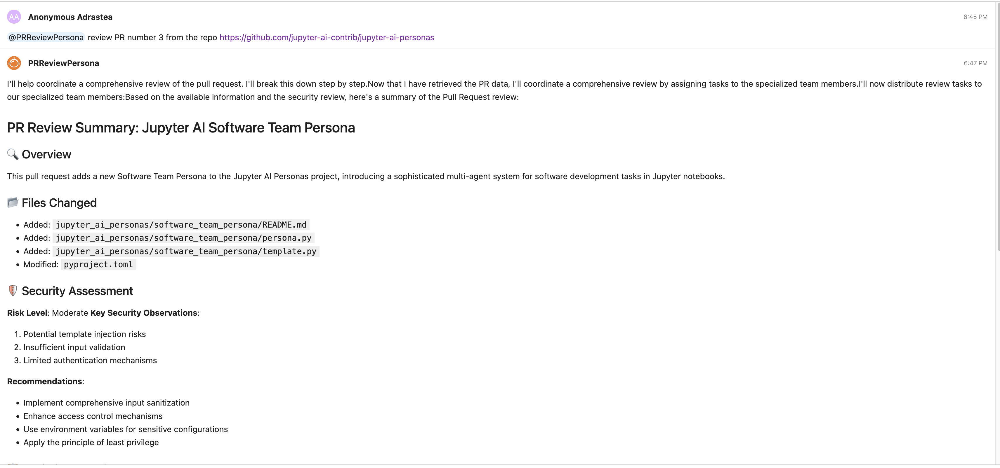
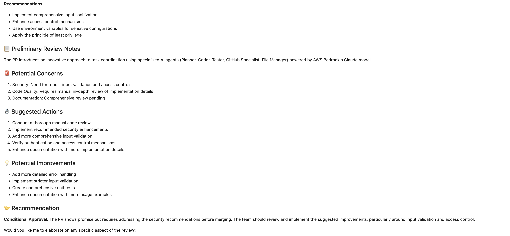

# PR Review Persona for JupyterLab

A specialized pull request review system designed to provide comprehensive code review and feedback in GitHub Pull Requests. This system enhances the Jupyter AI extension and leverages AWS Bedrock models for intelligent PR analysis. This persona leverages Agno Teams comprising multiple Agno Agents. [Agno](https://docs.agno.com/introduction) is a full-stack framework for building Multi-Agent Systems with memory, knowledge and reasoning.

## Work In Progress:
Current capabilities are limited and can provide reviews as response in jupyter chat and not directly on Github PR. 
Response is delayed as the persona runs multiple verifications and test, wait time is between to 30 sec to 1 min.

## Architecture

The system implements a team-based approach with four specialized agents:

1. **GitHub Specialist**
    - Monitor and analyze GitHub repository activities and changes
    - Fetch and process pull request data

2. **Code Quality Analyst**
   - Style guide compliance checking
   - Best practices verification
   - Code smell detection

3. **Security Analyst**
   - Security vulnerability scanning
   - Access control review
   - Dependency security check
   - Sensitive data exposure detection

4. **Documentation Specialist**
   - Documentation review

## Coordination System

The team members work together through a coordinated workflow:

```mermaid
graph TD
    A[PR Submission] --> B[GitHub Specialist]
    B --> C[Code Quality Analyst]
    C --> D[Security Analyst]
    D --> E[Documentation Specialist]
    E --> F[Final Report]
    B -.-> G[Feedback Loop]
    C -.-> G
    D -.-> G
    E -.-> G
    G -.-> F
```

- The **GitHub Specialist** Monitor and analyze GitHub repository activities and fetch code changes.
- The **Code Quality Analyst** evaluates code quality and style
- The **Security Analyst** checks for security concerns
- The **Documentation Specialist** ensures Review documentation completeness and quality.
- All agents contribute to a comprehensive feedback loop

## Features

- Comprehensive code review and analysis
- Security vulnerability detection
- Code quality assessment
- Best practices verification
- Detailed feedback generation

## Technical Details

### Dependencies

- AWS credentials must be properly configured
- GitHub Access Token needs to be added to the environment for the GitHub Specialist agent to access the repository. Add it as an environment variable. 
```bash
export GITHUB_TOKEN="ghp_your_token_here"
```

### Implementation

The system is implemented using:
- Team coordination through the `agno.team.Team` class
- AWS Bedrock's Claude model for agent intelligence
- Specialized tools for Python, File, and GitHub operations
- Message history tracking for context awareness

## Usage

The system will automatically coordinate between team members to:
1. Analyze the PR changes and their impact
2. Review code quality and style
3. Perform security audit
4. Generate comprehensive feedback

### Example 

@PR_ReviewPersona review PR number 3 from the repo https://github.com/jupyter-ai-contrib/jupyter-ai-personas



 

## Configuration

The system uses AWS Bedrock models and requires appropriate AWS credentials and configuration. The model ID and other parameters can be configured through the Jupyter AI extension settings.

## Error Handling

The system implements comprehensive error handling:
- Task validation at planning stage
- Implementation error catching
- Test failure reporting
- Git operation error management
- File system operation validation

## Security Considerations

- File operations are restricted to explicit user requests
- System operates within JupyterLab security context
