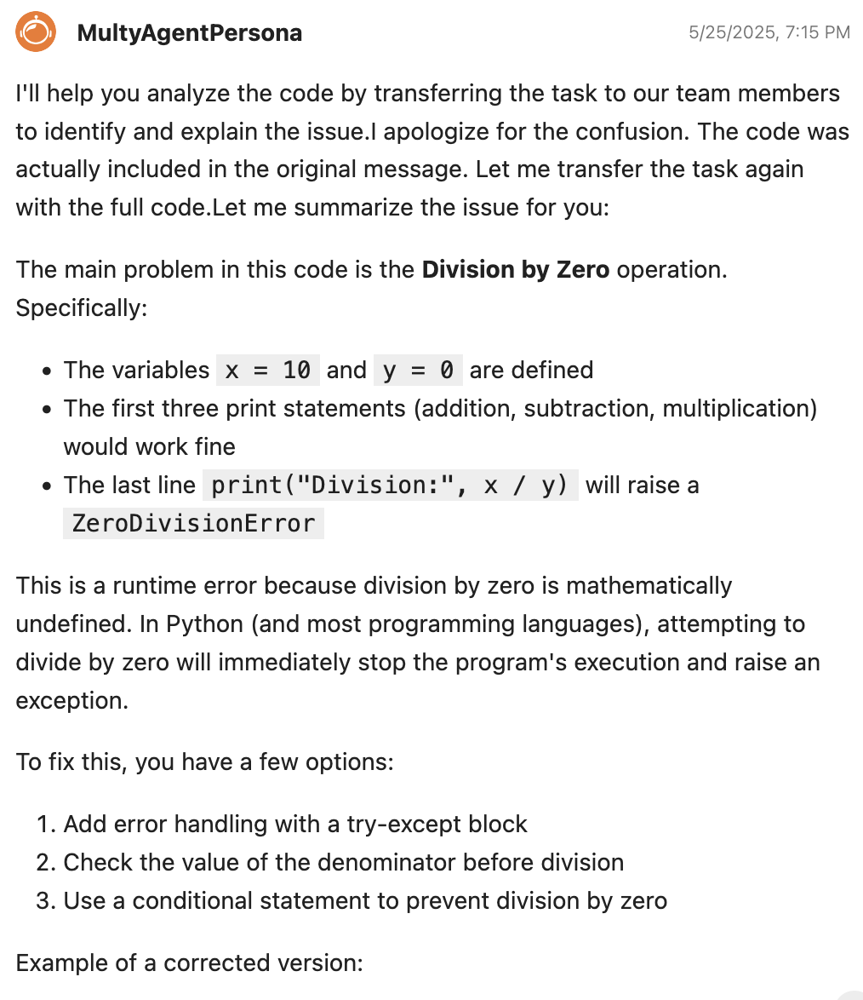
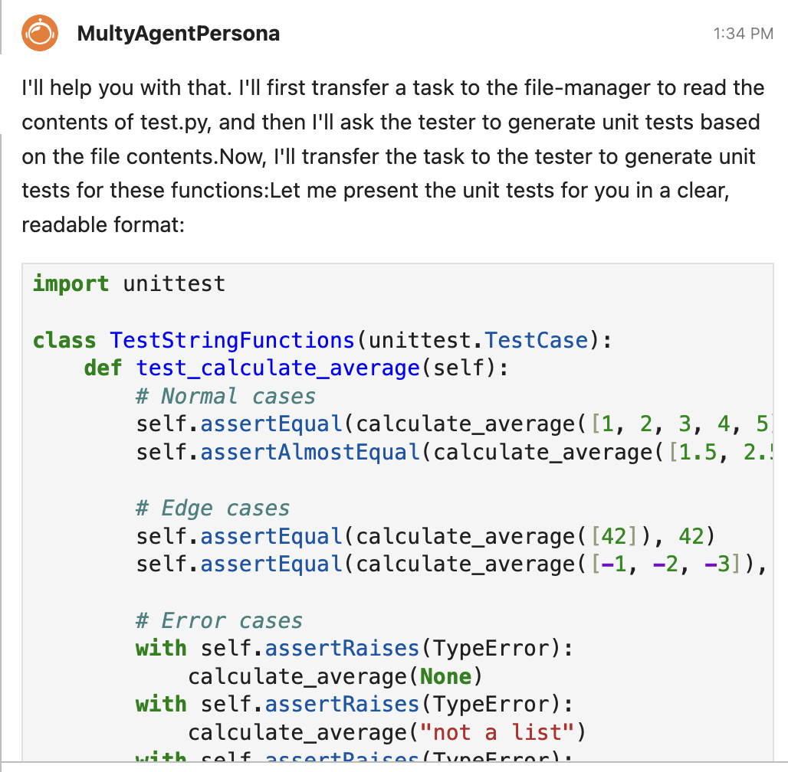

# Software Team Persona for JupyterLab

A sophisticated software development team system designed to enhance coding tasks in Jupyter notebooks through coordinated specialized agents. This system enhances the Jupyter AI extension and leverages AWS Bedrock models for intelligent task processing. This persona leverages Agno Teams conprising multiple Agno Agents. Agno is a full-stack framework for building Multi-Agent Systems with memory, knowledge and reasoning. [text](https://docs.agno.com/introduction)

## Architecture

The system implements a team-based approach with five specialized agents:

1. **Planner**
   - Strategic task decomposition
   - Technical requirement analysis
   - Challenge identification and mitigation planning

2. **Coder**
   - Implementation of solutions
   - Clean code writing following PEP 8
   - Best practices adherence
   - Documentation

3. **Tester**
   - Comprehensive testing implementation
   - Test coverage for normal and edge cases
   - Error condition validation
   - Test documentation

4. **GitHub Specialist**
   - Repository management
   - Git workflow optimization
   - Branch management
   - Repository metrics analysis

5. **File Manager**
   - Local file system operations
   - File reading and writing
   - File system management

## Coordination System

The team members work together through a coordinated workflow:

```mermaid
graph TD
    A[User Request] --> B[Planner]
    B --> C[Coder]
    C --> D[Tester]
    D --> E[GitHub Specialist]
    B -.-> F[File Manager]
    C -.-> F
    D -.-> F
    E -.-> F
```

- The **Planner** initiates the workflow by breaking down tasks.
- The **Coder** implements solutions based on the planner's specifications.
- The **Tester** validates the implementation.
- The **GitHub Specialist** manages version control and repository operations.
- The **File Manager** supports all team members with file system operations.

## Features

- Task decomposition and strategic planning
- Clean code implementation following Python best practices
- Comprehensive testing coverage
- Git workflow management
- Local file system operations
- Markdown-formatted responses
- LaTeX support for mathematical notation
- Code block formatting with language identification

## Technical Details

### Dependencies

- AWS Bedrock (Claude model)
- boto3
- langchain
- agno
- jinja2
- jupyterlab_chat
- jupyter_ai

### Implementation

The system is implemented using:
- Team coordination through the `agno.team.Team` class
- AWS Bedrock's Claude model for agent intelligence
- Specialized tools for Python, File, and GitHub operations
- Template-based prompt system using Jinja2
- Message history tracking for context awareness

## Usage

The software team system is automatically available through the Jupyter AI extension in JupyterLab. It can be accessed through Jupyter Chat and responds to user requests by coordinating its specialized team members.

Example usage:

The system will automatically coordinate between team members to:
 1. Plan the implementation
 2. Write the code
 3. Test the solution
 4. Manage version control
 5. Handle file operations as needed

### Example 1

@SoftwareTeamPersona is my code correct + {CODE}

### Example 2

@SoftwareTeamPersona can you help me create unit test for the code + {CODE}

 

## Configuration

The system uses AWS Bedrock's Claude model and requires appropriate AWS credentials and configuration. The model ID and other parameters can be configured through the Jupyter AI extension settings.

## Error Handling

The system implements comprehensive error handling:
- Task validation at planning stage
- Implementation error catching
- Test failure reporting
- Git operation error management
- File system operation validation

## Security Considerations

- File operations are restricted to explicit user requests
- GitHub operations require proper authentication
- AWS credentials must be properly configured
- System operates within JupyterLab security context
